# Image Processing Project 1

## 1. Image denoising

이미지 디노이징이란 어떤 영상을 원본(Ground-truth)영상으로 복원하기 위해 노이즈를 제거하는 작업을 말한다. 노이즈 제거 작업의 수단으로 이미지 필터링(Image Filtering) 작업을 수행하며 이 때문에 이미지 디노이징과 이미지 필터링이 혼재 사용되기도 한다.

이미지 필터링에는 Linear Filter 방식과 Non-Linear Filter 방식이 있는데 다음과 같은 두 가지 상황이 성립할 때 Linear Filter라고 일컫는다.

```mathematica
// Condition of Linear filter

1. c * F(input) == F(c * input)
2. F(x) + F(y) == F(x + y)
```

Linear Filter의 가장 큰 이점은 행렬계산을 통한 속도개선, 설계의 용이 등이 있다. 그러나 특수한 경우에서 Non-Linear Filter가 훨씬 좋은 효과를 내는 경우(예- median filter)도 상당수 존재하기 때문에 상황에 맞게 적절하게 사용하여야 한다.

### 1-1. Generate noises & noising

영상 복원 이전에, 테스트 케이스를 만들기 위해 Ground-truth Image에 노이즈를 만들어서 적용해본다.

사용되는 원본 영상은 다음과 같다. (Lena)

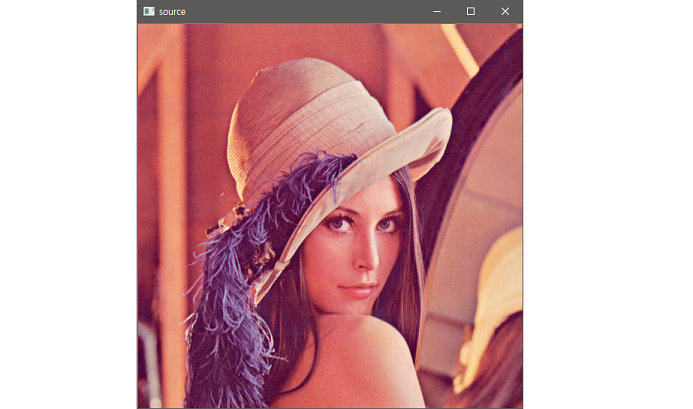


#### 1-1-1. Impulse noise

임펄스 노이즈는 주로 물리적, 통신적 장애로 인해 발생하는 노이즈 중 하나로써 영상에서는 일시적인 충격이나 저장매체의 물리적 충돌, 간섭 및 잘못된 동기화[^(1)]에 의해 발생한다.

[^(1)]: Impulse noise from [Wikipedea(Link)](https://en.wikipedia.org/wiki/Impulse_noise_(audio))

노이즈의 모양이 검은색`(value=0)` 또는 흰색`(value=255)`로 구성되어 있어 Salt & Pepper 라고도 부르며 임펄스 노이즈의 일반적인 형태는 다음과 같은 간략화된 코드로 표현할 수 있다.

```c++
// Impulse noise code #1 : General pseudo code

percent = 10%          //parameter
rand = random(0..100)  //parameter
    
output = 0       (rand < percent/2)
output = 255     (100-percent/2 < rand)
output = output  (otherwise)
```

이미지에 10% 픽셀 만큼 노이즈를 가하고 싶을 때 1부터 100사이의 난수를 생성하여 5%미만이라면 0(Pepper), 95%초과라면 255(Salt), 나머지의 경우 그대로의 값을 사용한다.

이러한 일반 난수 생성 방법 외에도 방법은 여러가지가 있다. 그의 간단한 예로 정규분포에 의거한 노이즈 생성을 아래와 같이 구현해 보았다.

```cpp
// Impulse noise code #2 : Implementation on c++

double standard_deviation = 10;
int threshold = 15;

for(int y=0; y<height; y++){
    for(int x=0; x<width; x++){
        int r = randn(127, standard_deviation); // 127:평균 의 정규분포 모델 내 난수 추출
        if(r < threshold)
            Image(y,x) = 0;
        else if(255-threshold < r)
            Image(y,x) = 255;
        else
            //no operation
    }
}
```

실제 사용된 코드에서는 [0,1) 범위의 percent 단위의 threshold(rate)와 정규분포의 모양을 결정하는 표준편차(sigma)가 파라미터로 사용되었다.

사용된 코드를 토대로 적용한 잡음 영상은 다음과 같다.

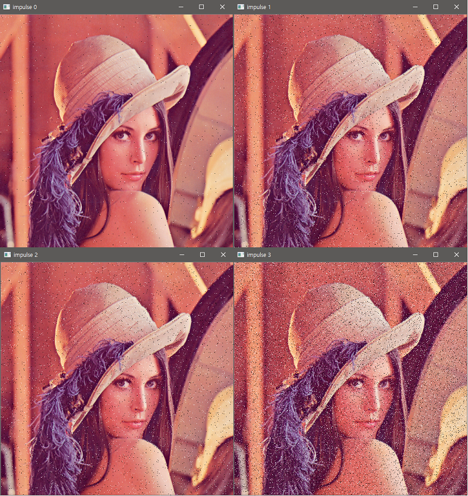 

|                    |                    |
| :----------------: | :----------------: |
| rate:0.1, sigma:40 | rate:0.3, sigma:40 |
| rate:0.1, sigma:50 | rate:0.3, sigma:50 |
|                    |                    |

#### 1-1-2. Gaussian noise

가우시안 노이즈는 정규 분포를 따르는 통계적인 노이즈로 일반적으로 AWGN(Additive White Gaussian noise)를 주로 지칭한다.

AWGN은 자연에서 발생하는 많은 무작위 프로세스의 효과를 모방하기 위해 사용되는 노이즈 모델[^(2)]\(백색 잡음을 모방하는 일반적인 모델)로써  다음과 같은 특징을 가진다.

[^(2)]: Addictive white Gaussian noise from [Wikipedia(Link)](https://en.wikipedia.org/wiki/Additive_white_Gaussian_noise)

- 모든 주파수의 값이 (**White** : 모든 주파수 성분을 다 포함하기 때문에 백색이라고 부른다.[^(3)])

  [^(3)]: 백색잡음 from [ktword(Link)](http://www.ktword.co.kr/abbr_view.php?m_temp1=4330)


- 정규분포(**Gaussian**)를 띄게 가중치를 (그러므로 검은색[#000000] ~ 흰색[#ffffff] 의 값이 정규분포를 띔)
- 원본 이미지에 더하는(**Addictive**) 노이즈(**Noise**)

이를 간략화된 코드로 나타내면 아래와 같다.

```cpp
// Gaussian noise code #1 : General pseudo code

for(auto pixel : Image){
    pixel += randn(0, standard_deviation)
}
```

위 코드를 토대로 구현하여 이미지에 적용한 결과는 다음과 같다.

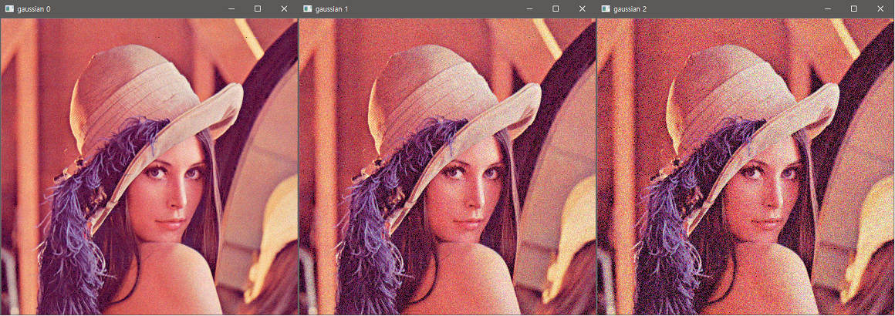

|            |            |            |
| :--------: | :--------: | :--------: |
| sigma : 10 | sigma : 20 | sigma : 30 |
|            |            |            |

#### 1-1-3. Uniform noise

유니폼 노이즈란 여러 값의 난수가 항상 같은 확률로 발생하는 노이즈이다.[^(4)]

[^(4)]: generating-uniform-noise from [AiShack(Link)](http://aishack.in/tutorials/generating-uniform-noise/)

확률밀도함수로 표현하면 다음과 같은 모양을 갖는다.[^(5)]


[^(5)]: Uniform distribution from [Wikipedia(Link)](https://en.wikipedia.org/wiki/Uniform_distribution_(continuous))

간략화된 코드로 표현하면 다음과 같다.

```cpp
// Uniform noise code #1 : General pseudo code

errLimit = 5   //parameter

for(auto pixel : Image){
    noise = rand() % (errLimit * 2 + 1) - errLimit
    pixel += noise
}
```

위 슈도 코드를 기반으로 작성된 프로그램을 통해 잡음 영상을 출력하였다.

파라미터에 따른 잡음 영상은 다음과 같다.

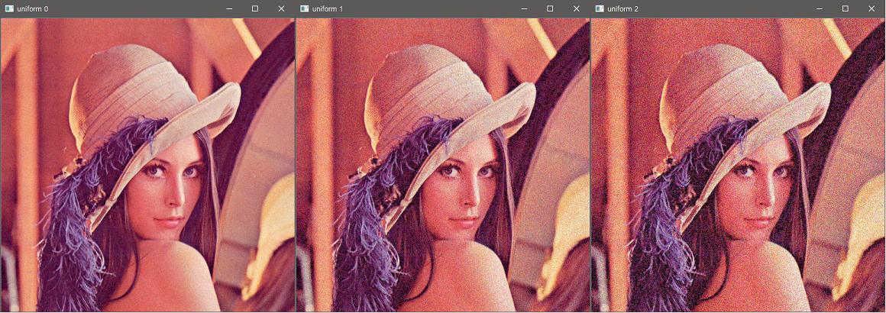

|               |               |               |
| :-----------: | :-----------: | :-----------: |
| errLimit : 15 | errLimit : 30 | errLimit : 45 |
|               |               |               |

### 1-2. Implement denoising filters & denoising 

`1-1. Generate noises & noising` 에서 구현한 노이즈가 적용된 영상을 다시 원본 이미지로 복원하기 위해 Denoising filter를 구현하여 적용해본다.

#### 1-2-1. Gaussian filter

가우시안 필터는 가우시안 블러(Gaussian blur, Gaussian smoothing)라고도 불리며 주변 픽셀을 이용하여 노이즈를 제거하는 방법이다.

Gaussian filter의 기본적인 아이디어는 적용할 픽셀에서 거리가 멀어질 수록 더 작게 부여되는 가중치의 가중평균  (weighted Average)을 해당 픽셀에 적용하는 방법으로 이루어진다.

```cpp
// Gaussian filter code #1 : distance weighted Average filter - pseudo code

distanceWeight[3][3] ={
{0.3, 0.5, 0.3},
{0.5, 0.7, 0.5},
{0.3, 0.5, 0.3}};

for(int i=0;i<3;i++){
    for(int j=0;j<3;j++){
        Image(y,x) = Image(y+i-1, x+j-1) * distanceWeight[i][j]
    }
}
```

이 때, distanceWeight를 정규분포를 따르게 하면 Gaussian filter가 된다.

커널의 크기는 3x3이 아니어도 5x5, 7x7 등 가능하며 그에 맞는 가우시안 값을 weight로 취해주면 된다.

가우시안 값은 표준편차에 따라 미리 계산한 뒤 적용함으로써 얻을 수 있다.

그림으로 표현하면 가우시안 블러는 다음과 같은 가우시안 분포를 가지는 weight를


다음과 같은 커널에 정규화(Normalization : 커널의 합이 1이 되게 함)하여 적용함으로써

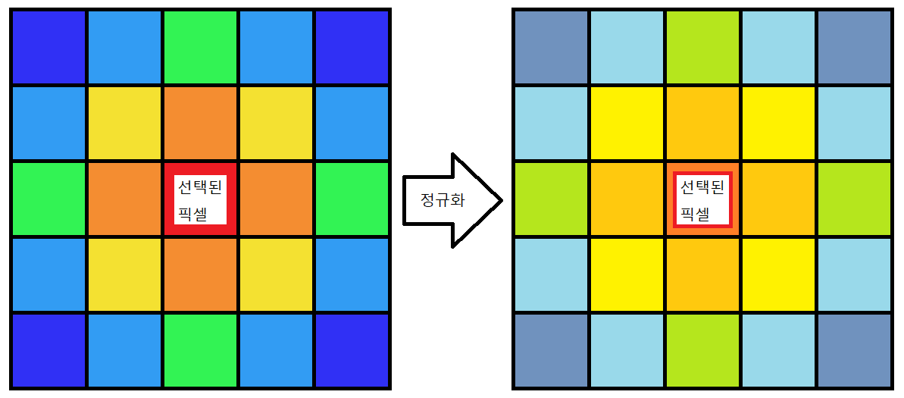

얻어지는 다음과 같은 매트릭스[^(6)]

[^(6)]: Gaussian sample matrix : from [Wikipedia(Link)](https://en.wikipedia.org/wiki/Gaussian_blur)

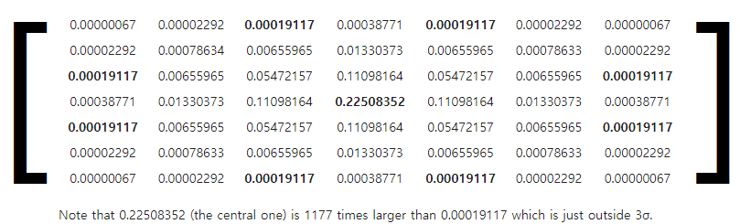

를 이용하여 노이즈를 제거하게 된다.

이러한 방식으로 구현된 가우시안 블러는 파라미터마다 다음과 같은 결과를 보였다.

> 가우시안 노이즈가 적용된 이미지에 가우시안 필터를 사용하였다.
>
> 커널의 크기는 $\sigma$에 따라 $6\sigma$ 이상인 홀수를 사용하였다.

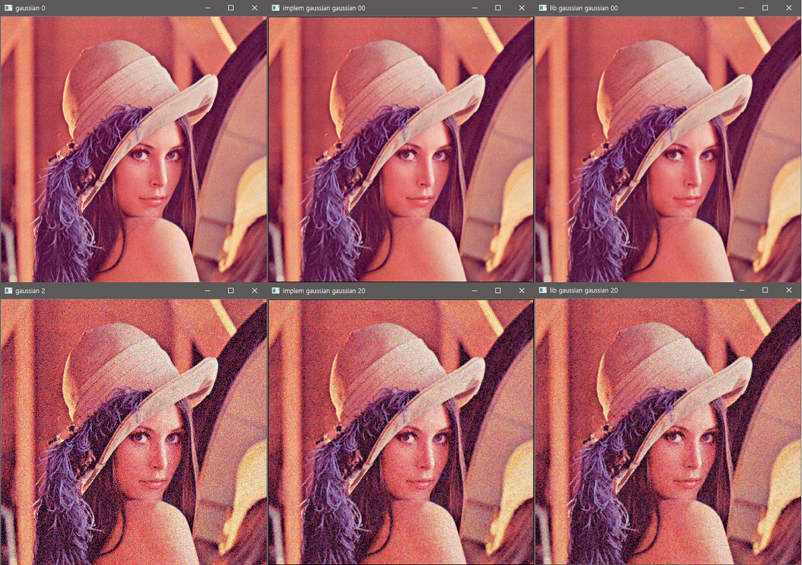

|     잡음 영상     |    구현한 필터    |  라이브러리 필터  |
| :---------------: | :---------------: | :---------------: |
| 가우시안 잡음(약) | Kernel Size : 3x3 | Kernel Size : 3x3 |
| 가우시안 잡음(강) |    sigma : 0.5    |    sigma : 0.5    |
|                   |                   |                   |

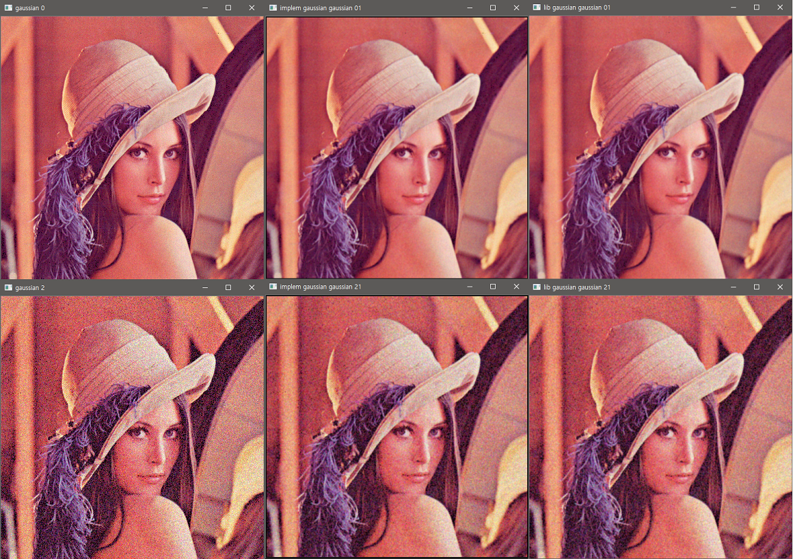

|     잡음 영상      |    구현한 필터    |  라이브러리 필터  |
| :----------------: | :---------------: | :---------------: |
| 가우시안 잡음 (약) | Kernel Size : 5x5 | Kernel Size : 5x5 |
| 가우시안 잡음 (강) |    sigma : 0.8    |    sigma : 0.8    |
|                    |                   |                   |

커널의 크기와 편차가 클수록 블러링(뭉개지는 현상) 효과가 컸으며 영상의 노이즈가 상당 부분 제거되었다.

####1-2-2. Bilateral filter

https://users.soe.ucsc.edu/~manduchi/Papers/ICCV98.pdf

가우시안 필터의 문제점은 이미지의 경계(edge) 또한 blur효과 때문에 뭉개진다는 점이다.

이러한 문제점을 해결하기 위한 방법으로 이미지 픽셀 간 거리 뿐 아니라 픽셀 값 자체의 거리에도 가우시안 가중치를 사용하는 방법을 사용했다.

이를 수식으로 표현하면 다음과 같다.

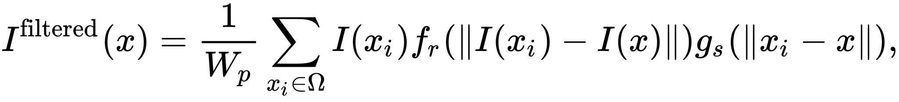[^(7)]

[^(7)]: Bilateral filter's  mathematical definition from [Wikipedia(Link)](https://en.wikipedia.org/wiki/Bilateral_filter)

이 때 각 항은 다음과 같다.

- $W_p$ : Normalization을 위한 수
- $\Omega$ : 커널로 인해 속한 모든 주변픽셀의 집합
- $f_r$ : 픽셀간 거리의 차에 대한 함수. (가우시안 함수가 보편적으로 사용 됨)
- $g_s$ : 픽셀 값간 거리의 차에 대한 함수. (가우시안 함수가 보편적으로 사용 됨)

간략화된 코드로 나타내면 다음과 같은 형태를 갖는다.

```cpp
// Bilateral filter code #1 : Psuedo code

gaussianWeight[N][N] = {...}
border = N/2

for y from border to height-border{
    for x from border to width-border{
        Blurimage(y,x) = 0;
        for xx from -border to border{
            for yy from -border to border{
                bilateral = image(y+yy,x+xx)*gaussianWeight(yy,xx); //픽셀 간 거리
                bilateral *= getGaussianWeightFromDistance( abs( image(y,x) - image(yy,xx) ) ); //픽셀값 간 거리
                Blurimage(y,x) += bilateral;
            } 
        }
    }
}
```

이로써 바이레터럴 필터는 경계가 무뎌지는 것을 방지(edge preserving)하면서 노이즈를 감소(noise reducing)시킬 수 있다. 아래는 이를 토대로 얻은 복원영상과 라이브러리의 비교이다. (좌측이 직접구현, 우측이 라이브러리 사용)


|                    직접구현                    |                   라이브러리                   |
| :--------------------------------------------: | :--------------------------------------------: |
| Kernel Size(5), SigmaColor(30), SigmaSpace(30) | Kernel Size(5), SigmaColor(30), SigmaSpace(30) |
| Kernel Size(5), SigmaColor(50), SigmaSpace(30) | Kernel Size(5), SigmaColor(50), SigmaSpace(30) |
| Kernel Size(5), SigmaColor(30), SigmaSpace(50) | Kernel Size(5), SigmaColor(30), SigmaSpace(50) |
| Kernel Size(7), SigmaColor(40), SigmaSpace(40) | Kernel Size(7), SigmaColor(40), SigmaSpace(40) |
| Kernel Size(7), SigmaColor(60), SigmaSpace(60) | Kernel Size(7), SigmaColor(60), SigmaSpace(60) |
|                                                |                                                |

구현상의 차이로 파라미터가 같아도 동일한 영상을 출력하지 못했지만 Smoothing 효과를 얻으면서 동시에 에지는 보존되는 현상을 볼 수 있다.

#### 1-2-3. Median filter

메디안 필터는 주변 픽셀의 값 중 중간값을 취하여 해당 픽셀에 적용하는 필터이다. Gaussian Filter와 같이 Blurring 효과를 갖고 있기 때문에 Median Blur 라고도 한다.

하지만 주변 픽셀의 평균값과 유사한 Weighted Average 방식을 사용하는 Gaussian Filter와 달리 중간값을 취하기 때문에 모든 픽셀의 영향을 받지 않고 주변 픽셀 중 중간에 있는 한 값에만 영향을 받는다.

이 때문에 특정 장애로 인해 값의 분포가 다소 비정상적인 형태를 띄는 임펄스 노이즈같은 경우 메디안 필터를 통해 효과적으로 노이즈를 제거할 수 있다.

메디안 필터의 슈도코드는 다음과 같다.

```cpp
// Median filter code #1 : Pseudo code

1. 해당 픽셀 주변 값(예: 3x3)을 구한다.
2. 정렬한다.
   [0, 0, 70, 75, 73, 80, 79, 100, 255] -> [0, 0, 70, 73, 75, 79, 80, 100, 255]
3. 중간 값을 찾는다. 짝수 개일 경우 두 값의 평균으로 취한다.
   [0, 0, 70, 73, (75), 79, 80, 100, 255] -> 75
4. 해당 픽셀의 값을 75로 취한다.
```

슈도코드에서도 알 수 있듯이 일반적인 Filter와 같이 Convolution Filter(Kernel과 주변픽셀의 합성곱으로 픽셀의 값을 취하는 방식)이 아니며 Matrix형태로 나타낼 수 없는 Non-Linear Filter이다. 위에서 상술한 Linear Filter의 2가지 조건도 충족하지 못한다.

위 알고리즘을 토대로 구한 메디안 블러 이미지는 다음과 같다.

> 임펄스 노이즈가 적용된 이미지에 메디안 필터를 사용하였다.

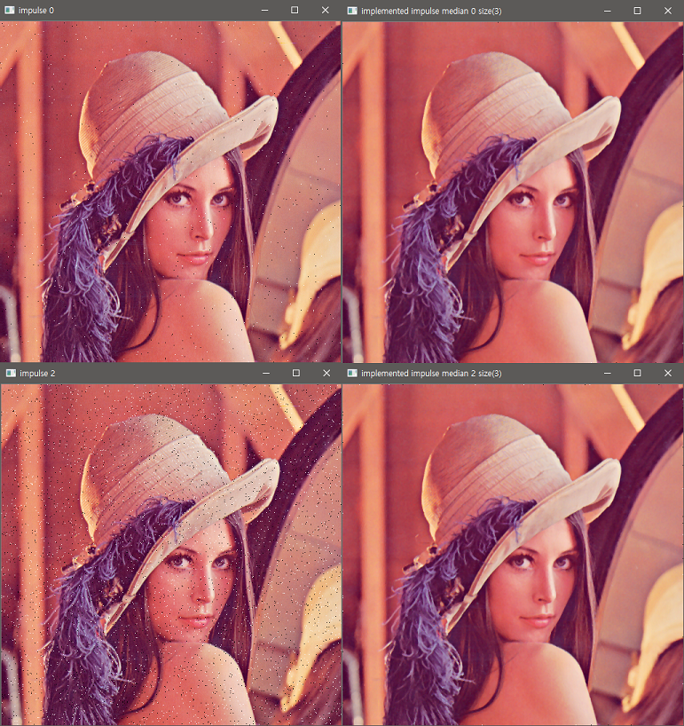

| 좌측 영상(노이즈 영상) |      우측 영상(복원 영상)       |
| :--------------------: | :-----------------------------: |
|                        | (Kernel 크기가 3인 메디안 필터) |

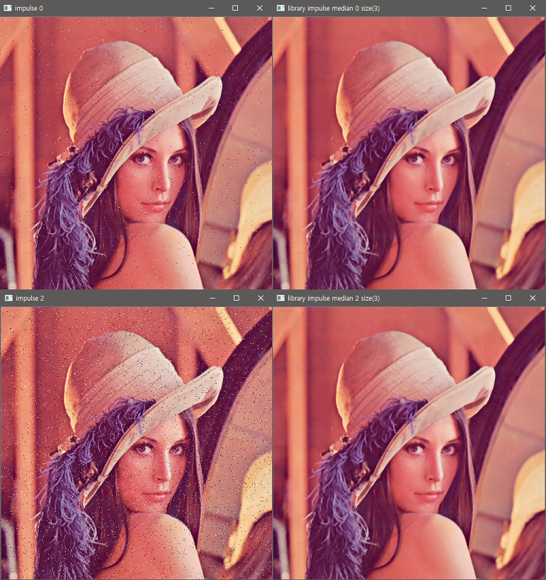

| 좌측 영상(노이즈 영상) |      우측 영상(복원 영상)       |
| :--------------------: | :-----------------------------: |
|                        |     (라이브러리를 사용함.)      |
|                        | (Kernel 크기가 3인 메디안 필터) |

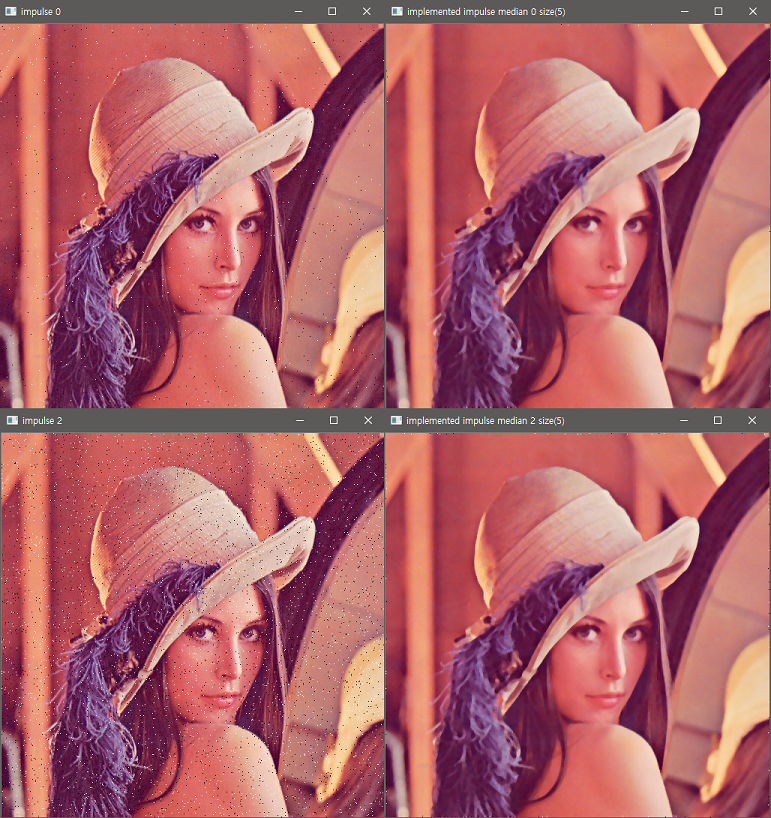

| 좌측 영상(노이즈 영상) | 우측 영상(복원 영상) |
| :--------------------: | :------------------: |
|                        |  (Kernel 크기 : 5)   |

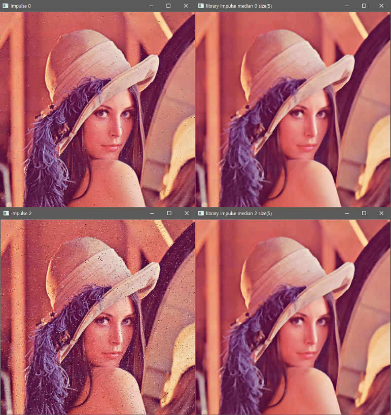

| 좌측 영상(노이즈 영상) |    우측 영상(복원 영상)    |
| :--------------------: | :------------------------: |
|                        | (Kernel 크기 : 5, library) |


##### 1-2-3 (2). 성능 향상 Approach

임펄스 노이즈에 한해 성능 향상과 속도 개선을 가져올 수 있는 방법으로 특정 픽셀이 0 또는 255일 때만 Median 을 취하는 방법이 있다. 이러한 강화된 Approach로 얻게되는 결과는 다음과 같다.

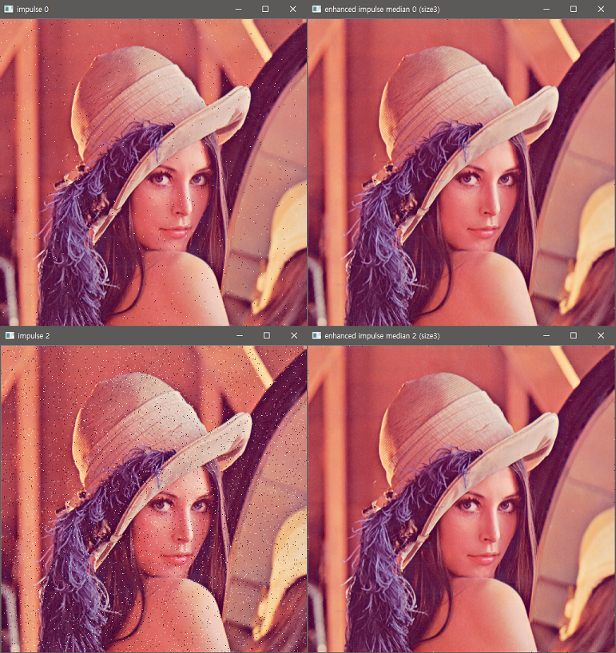

| 좌측 영상(노이즈 영상) |          우측 영상(복원 영상)           |
| :--------------------: | :-------------------------------------: |
|                        | (강화된 Median Filter, Kernel 크기 : 3) |


| 좌측 영상(노이즈 영상) |          우측 영상(복원 영상)           |
| :--------------------: | :-------------------------------------: |
|                        | (강화된 Median Filter, Kernel 크기 : 5) |


### 1-3. Compare & analyze

생성한 노이즈를 원본영상으로 복원하는 데에 있어서 어떤 필터가 좋은 효과를 갖는지 주관적(육안)/객관적(수치평가) 측면에서 비교 분석 해본다.

#### 1-3-1. subjective compare

Impulse noise에 대해 3가지 filter를 적용해보았다.

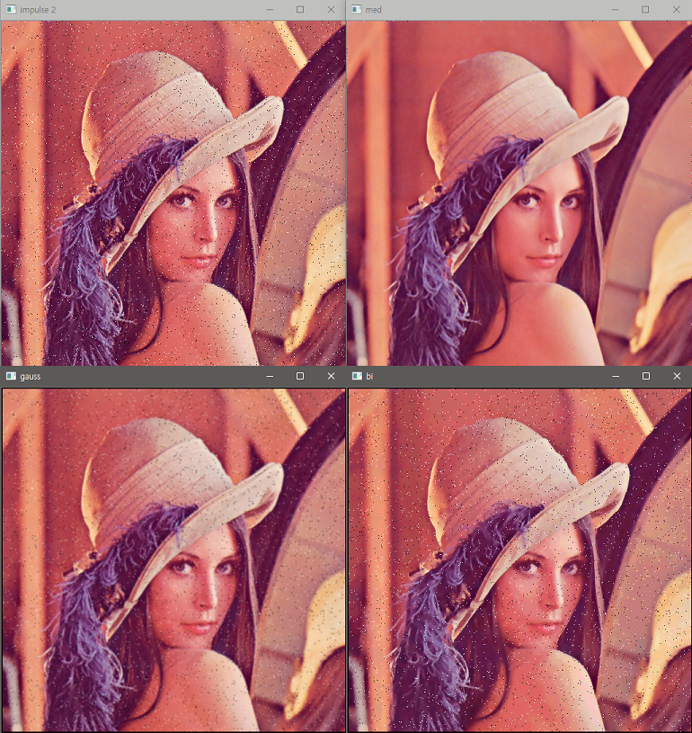

|                          |                       |
| :----------------------: | :-------------------: |
| 잡음 영상(Impulse noise) |  Median filter 복원   |
|   Gaussian filter 복원   | Bilateral filter 복원 |
|                          |                       |

메디안 필터는 아주 잘 잡아냈고 가우스는 임펄스 잡음을 없애지 않고 블러링 시킨 모습을 보인다.

바이레터럴 필터는 튀는 값에 대해 가중치가 상당히 낮으므로 Salt, Pepper가 거의 원색 그대로 남아있음을 확인할 수 있었다.

---

가우시안 노이즈에 3가지 필터를 적용해 보았다.

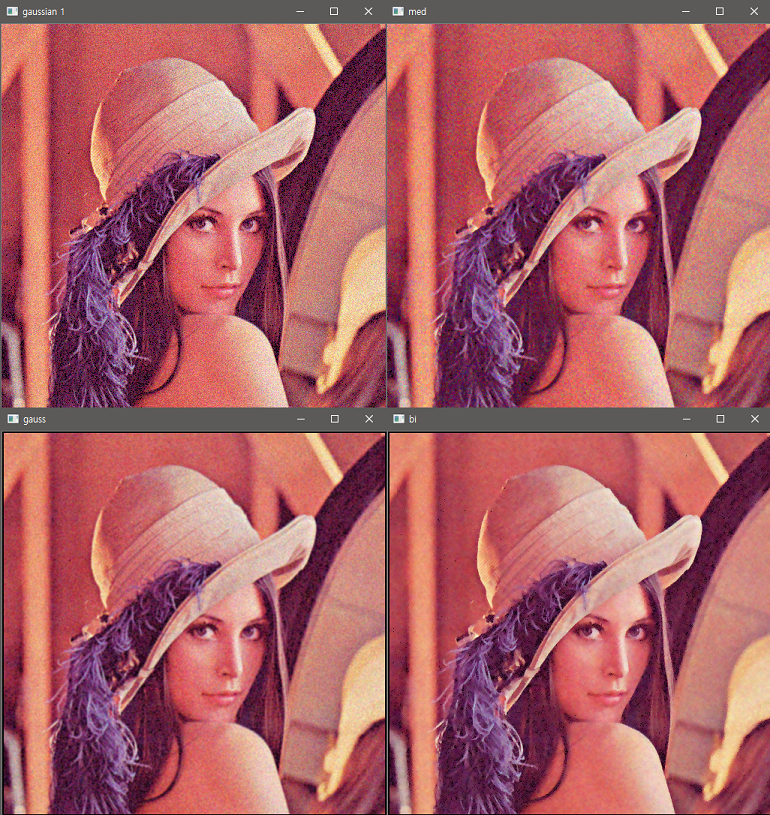

|                           |                       |
| :-----------------------: | :-------------------: |
| 잡음 영상(Gaussian noise) |  Median filter 복원   |
|   Gaussian filter 복원    | Bilateral filter 복원 |
|                           |                       |

육안으로 보기에는 기존에 있던 백색잡음들이 Median filter 복원 시도 후에도 남아있는 것이 보인다. (알록달록한 색의 잡음이 남아 있음.) 그에 반해 Gaussian filter는 매끄럽진 않지만 메디안 필터보다는 다소 좋은 모습을 보인다. Bilateral filter의 경우에는 백색잡음도 상당히 줄어들고 모자부분의 에지가 살아있어 훨씬 더 보기 좋다.

---

유니폼 노이즈에 3가지 필터를 적용해 보았다.

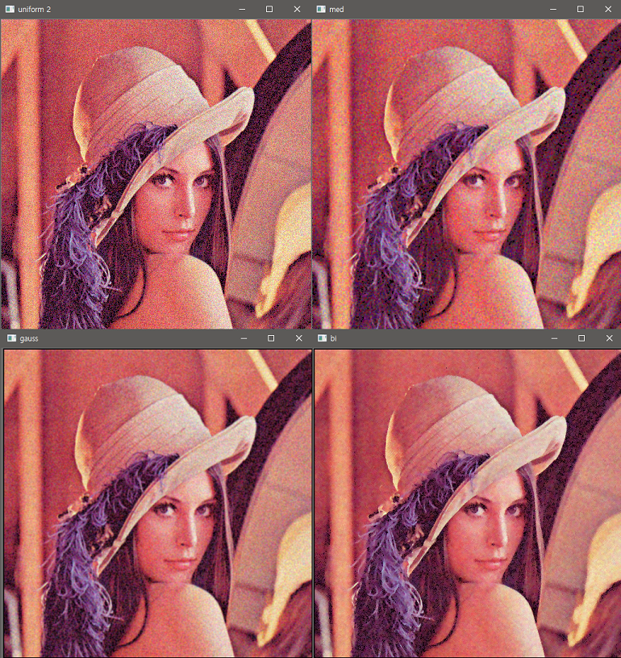

|                          |                       |
| :----------------------: | :-------------------: |
| 잡음 영상(Uniform noise) |  Median filter 복원   |
|   Gaussian filter 복원   | Bilateral filter 복원 |
|                          |                       |

유니폼 노이즈 역시 메디안 필터가 제일 성능이 낮아보인다. 위 가우시안 노이즈 영상보다 더 잡음이 많이 생겨서인지 Bilateral filter 복원 후 영상이 얼굴 쪽에서 상당히 뭉개진 느낌을 준다. 그렇지만 백색잡음 효과는 Gaussian filter보다 더 좋아보인다.

#### 1-3-2. objective (PSNR) measurement.

Mean Squared Error(두 픽셀 값 간의 제곱차의 평균)을 이용하여 측정했다.

MSE는 낮을수록 좋다.

---

임펄스 노이즈에 대한 경우 평균에러가 각각

- median filter : 6 (육안으로도 보기 좋았었음)
- gaussian filter : 19
- bilateral filter : 26

으로 육안으로 보았을 때와 유사하게 측정됐다.

---

가우시안 노이즈에 대한 경우 육안으로 보았을 때와 달리 MSE가 각각

- median filter : 18
- gaussian filter : 19
- bilateral filter : 19 (육안으로 보기 좋았던 필터)

의 값으로 유사하게 측정됐다.

픽셀 값 간의 차일 뿐 실제 인간의 눈처럼 유사도를 유추하는 것이 아니기 때문에 PSNR로 측정하는 경우 육안과 상이한 경우가 발생할 가능성이 있다.

---

유니폼 노이즈에 대한 경우 가우시안 노이즈와 유사했는데 MSE는 각각

- median filter : 25
- gaussian filter : 21
- bilateral filter : 21 (육안으로 보기 좋았던 필터)

의 값으로 측정됐다. 실제 육안으로도 gaussian 과 bilateral 의 차이가 크지 않았던 만큼 육안과 비슷하게 측정이 된 것 같다.

## 2. Edge detection

영상의 특성을 검출하는 데 있어서 기본적이면서 중요한 특성이 `Flat`, `Edge`, `Corner` 이다. Flat은 영상이 평평한가(변화가 거의 없는가), Edge는 경계에 속하고 있는가, Corner는 모서리인가 에 대한 정보를 일컫는 말이다. 다음은 이 중 Edge 정보를 얻기 위한 Approach 중 미분을 이용한 방법을 소개한다.

### 2-1. 1$^{st}$ order edge detector

1차 미분 검출기의 핵심은 밝기가 갑자기 바뀌는 부분을 에지로 취하는 것이다.

밝기의 변화율이 높다 = 값의 변화가 크게 일어난다 = 경계가 존재한다. 라는 아이디어에서 시작한다. 영상에서의 미분은 근접 픽셀과의 차와 같다.

> $$
> f(x+\alpha)-f(x) = (x - \alpha) f'(x)
> $$
> 에서 $\alpha$가 0으로 근접해야 성립하는데, 영상에서는 가장 작은 단위가 1픽셀이기 때문이다.

그래서 다음과 같은 형태의 Kernel을 가지는 Filtering을 수행하면 에지를 검출할 수 있게 된다.

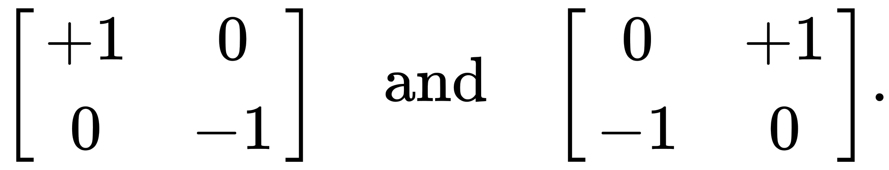[^(8)]

[^(8)]: Roberts cross Matrix image from [Wikipedia(Link)](https://en.wikipedia.org/wiki/Roberts_cross)

#### 2-1-1. Prewitt detector

대표적인 1차 미분 검출기의 예가 바로 프레윗 검출기이다. 위와 같은 xx검출기에서는 커널 크기가 짝수여서 에지가 한칸씩 시프트되는 현상이 발생한다. 그에 반해 홀수 크기의 커널은 시프트되지 않는다. 다만 1줄로 나오는 에지가 2줄로 나오게 돼 생각보다 더 굵은 에지가 검출된다.

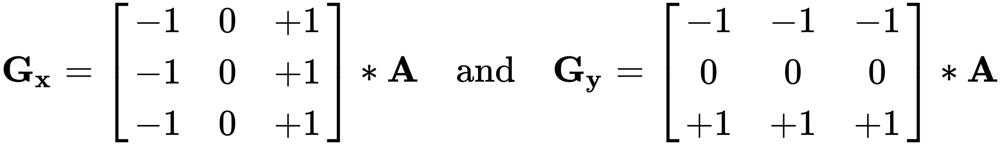[^(9)]

[^(9)]: Prewitt Matrix image from [Wikipedia(Link)](https://en.wikipedia.org/wiki/Prewitt_operator)

위와 같은 커널로 필터링 한 뒤 나온 x축 미분 이미지 Ix 와 y축 미분 이미지 Iy에 대해 `sqrt(Ix^2 + Iy^2)`를 함으로써 최종적으로 얻을 수 있게 된다.

프레윗 검출기로부터 얻어진 경계 영상(edge image)는 다음과 같다.

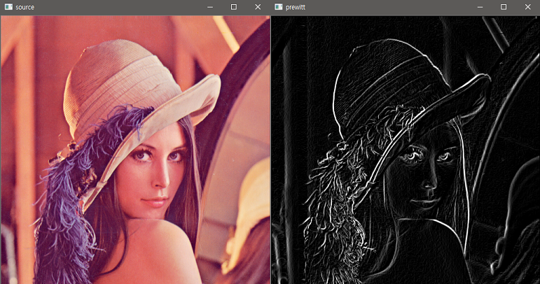

| 원본 영상 | Prewitt 검출기를 통해 얻은 에지 영상 |
| :-------: | :----------------------------------: |
|           |                                      |

#### 2-1-2. Sobel detector

Sobel-Feldman operator라고도 불리며 1차 미분 에지 검출기 중 하나이다.

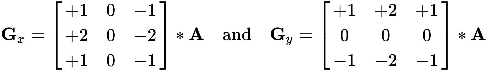[^(10)]

[^(10)]: Sobel Matrix image from [Wikipedia(Link)](https://en.wikipedia.org/wiki/Sobel_operator)

프레윗 검출기에 보다 가까운 연속성을 가진 픽셀에 대해 절대적인 가중치를 더 부여한다.

소벨 검출기로부터 얻어진 경계 영상(edge image)는 다음과 같다.

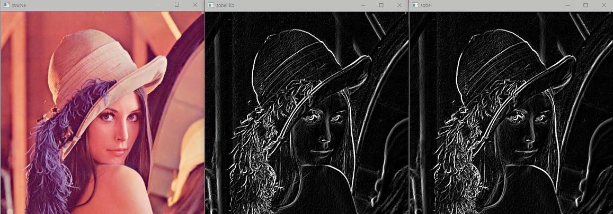 

| 원본 영상 | 라이브러리 사용 검출 | 직접 구현 검출 |
| :-------: | :------------------: | :------------: |
|           |                      |                |

### 2-2. 2$^{nd}$ order edge detector

#### 2-2-1. LoG

1차 미분 검출기의 단점은 edge 영상을 이진화 시킬 경우 특정 threshold를 넘어서면 edge가 너무 굵어진다는 것이다. 2차 미분은 이러한 굵어지는 문제점을 해결하기 위한 방법으로 변화율이 높은 지점을 찾는 데 그치지 않고, 극점을 찾는다. 그러나 영상에는 상당히 많은 극점이 분포되어있기 때문에 threshold로 제한을 걸어두거나 가우시안 스무딩을 이용하여 무뎌지게 한다.

LoG는 가우시안(Gaussian)을 이용하여 스무딩한 뒤 2차 미분 검출기(Laplacian)를 사용하여 에지를 검출하는 필터이다.

2차 미분 값은 검출 후 극점인지 확인하기 위해 주변 픽셀을 이용하여 0교차가 일어나는지 확인한다. 0교차가 일어난다면 그 부분에서 극점이 발생했음을 의미하며 이를 에지라고 생각하고 그려주면 된다.

라플라시안 오브 가우시안 에지 검출기를 구현하여 얻은 영상은 다음과 같다.

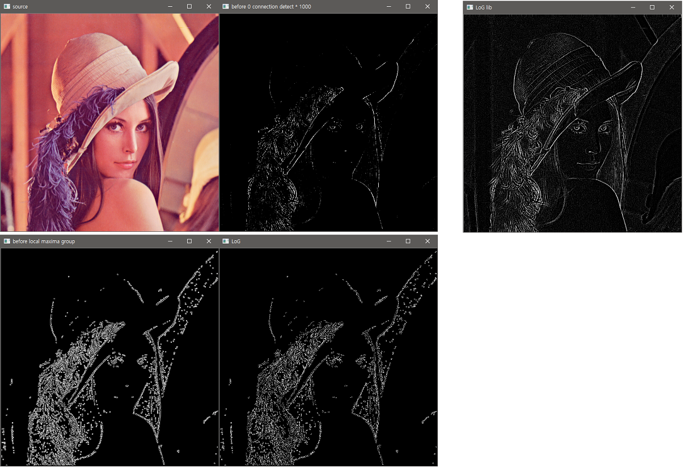

| 원본영상 (1)                      | 0교차 이전 영상 (2) | Laplacian 라이브러리 사용 화면 (5) |
| --------------------------------- | ------------------- | ---------------------------------- |
| Local Grouping Maxima 사용 전 (3) | 결과 (4)            |                                    |

원본영상(1)에서 LoG(가우시안을 취한 2차미번 커널)을 갖고 필터링을 시킨 뒤(2) 0교차 여부를 검사하여 교차한다면 해당 LoG의 결과 값을 사용한다.(3) 이후 Local Grouping Maxima(*제가 직접 만든 용어입니다. local maxima를 취하되, 허용오차를 일정 허용함으로써 Corner처럼 점이 찍히는 현상을 방지하면서 지역적으로 높은 값을 가져오고자 사용하였습니다.*)를 취하여 결과(4)를 얻었다.

OpenCV에서 제공하는 Laplacian 라이브러리를 사용한 결과(5)는 위와 같다.

Laplacian 라이브러리의 파라미터는 {커널크기:3}을 사용했다.

### 2-3. Compare & analyze

구현한 2가지 접근방식의 detector들이 어떤 장단점을 갖는지 주관적/객관적으로 분석 비교한다.

#### 2-3-1. subjective compare

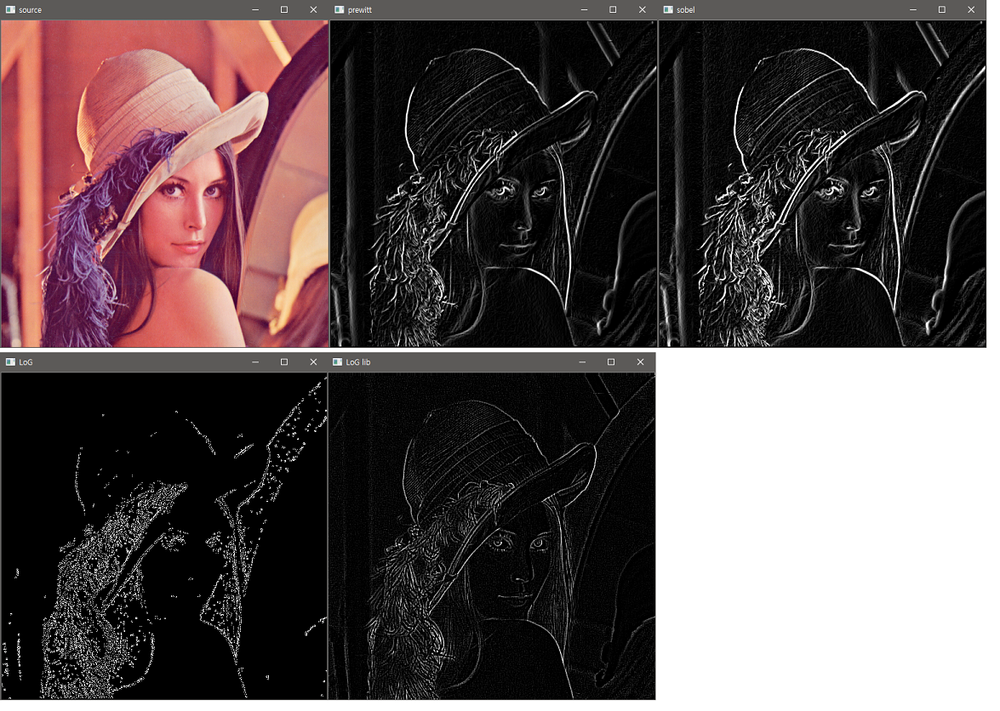

|          |                   |       |
| :------: | :---------------: | :---: |
| 원본영상 |      Prewitt      | Sobel |
|   LoG    | Laplacian library |       |
|          |                   |       |

> LoG 구현이 미숙하여 Laplacian Library 이미지를 추가로 첨부하였다.

Prewitt과 Sobel은 눈으로 보기에는 에지가 선명하게 검출되어 상당히 잘 검출된 것 처럼 보이긴 하나, 눈으로 볼 때 선명하다는 의미는 많은 픽셀들이 뭉쳐있다는 의미와도 상통하므로 에지만 검출해야할 일이 있다면 예상보다 많은 중첩된 픽셀들의 값들을 얻게 될 것이다. 그에 반해 Laplacian Library의 경우 노이즈가 있긴 하나 얇은 에지를 잘 검출하는데 성공적인 것으로 보인다.