# Image Processing Project 2

## 1. Image transformation

이미지를 임의의 offset으로 이동시키고, 임의의 회전과 확대, 축소 변환을 수행하는 방법은 각 좌표 (x, y)를 매트릭스 변환을 통해 warping 시키는 작업으로 선형적인 연산을 통해 구현될 수 있다.

### 1-1. Transform Matrix

#### (1) Transition

$$
\begin{bmatrix} y'\\x'\\1 \end{bmatrix} = 
\begin{bmatrix}
1 & 0 & offset_y
\\
0 & 1 & offset_x 
\\
0 & 0 & 1 
\end{bmatrix} 
\begin{bmatrix} y\\x\\1 \end{bmatrix} ... (1)
$$

원래 Transition transform은 아래$(2)$와 같은
$$
\begin{bmatrix} y'\\x' \end{bmatrix} = 
\begin{bmatrix}
1 & 0 
\\
0 & 1
\end{bmatrix} 
\begin{bmatrix} y\\x \end{bmatrix}
+
\begin{bmatrix} offset_y\\ offset_x \end{bmatrix} ... (2)
$$
Affine transform 이지만 $(1)$과 같이 동차좌표계를 이용하여 linear하게 만들 수 있다.

이는 후에 설명할 복합 변환에 있어서도 아주 중요하다.

#### (2) Rotation

$$
\begin{bmatrix} y'\\x'\\1 \end{bmatrix} = 
\begin{bmatrix}
cos(\theta) & sin(\theta) & 0
\\
-sin(\theta) & cos(\theta) & 0
\\
0 & 0 & 1 
\end{bmatrix} 
\begin{bmatrix} y\\x\\1 \end{bmatrix}
$$

회전 변환은 $(y,x) = (0,0)$ 인 점을 기준으로 회전하기 때문에 중점을 기준으로 회전하는 일반적인 생각과는 다르게 회전된다.

이를 해결하기 위해서는 $(0,0) -> (center.x, center.y)$ 로 먼저 transition 변환을 한 뒤 회전 하고 다시 $(center.x, center.y) -> (0,0)$ transition 변환을 수행하여 예상과 같은 결과를 얻을 수 있다.

후에 설명하는 복합 변환에서는 3번의 변환으로 인해 느려지는 문제점을 1번의 변환 속도만큼 끌어올릴 수 있는데 그러한 변환 매트릭스와 동일한 성능을 가지는 변환 매트릭스[^1]는 다음과 같다.

[^1]: [opencv docs - getRotationMatrix2D](https://docs.opencv.org/2.4/modules/imgproc/doc/geometric_transformations.html?highlight=getrotationmatrix2d#getrotationmatrix2d)

$$
\begin{bmatrix} y'\\x'\\1 \end{bmatrix} = 
\begin{bmatrix}
cos(\theta) & sin(\theta) & (1-cos(\theta)) center.x\ -\ sin(\theta) center.y
\\
-sin(\theta) & cos(\theta) & sin(\theta)center.x\ +\ (1-cos(\theta)) center.y
\\
0 & 0 & 1 
\end{bmatrix} 
\begin{bmatrix} y\\x\\1 \end{bmatrix}
$$

#### (3) Scaling

$$
\begin{bmatrix} y'\\x'\\1 \end{bmatrix} = 
\begin{bmatrix}
scaleX & 0 & 0
\\
0 & scaleY & 0
\\
0 & 0 & 1 
\end{bmatrix} 
\begin{bmatrix} y\\x\\1 \end{bmatrix}
$$

마찬가지로 만약 중점을 기준으로 확대하고 싶다면 중점으로 이동한 뒤 확대하면 된다.

기본적인 Scaling 변환은 (0,0) 좌표가 (0,0)으로 가는 결과를 보여준다.

### 1-2. Composite transform

위 변환 행렬들은 모두 선형이기때문에 transform matrix 들끼리 먼저 계산을 한 뒤 계산을 하면 연산 개수만큼 n배로 늘어나는 성능을 가질 수 있다. 다만 행렬 특성상 앞에 곱할지 뒤에 곱할지에 따라 결과가 바뀔 수 있다.

중점을 기준으로한 회전변환의 경우 다음과 같이 나타낼 수 있다.
$$
\begin{bmatrix} y'\\x'\\1 \end{bmatrix} = 

\begin{bmatrix}
1 & 0 & -center.y
\\
0 & 1 & -center.x 
\\
0 & 0 & 1 
\end{bmatrix} 

\begin{bmatrix}
cos(\theta) & sin(\theta) & 0
\\
-sin(\theta) & cos(\theta) & 0
\\
0 & 0 & 1 
\end{bmatrix} 


\begin{bmatrix}
1 & 0 & center.y
\\
0 & 1 & center.x 
\\
0 & 0 & 1 
\end{bmatrix} 

\begin{bmatrix} y\\x\\1 \end{bmatrix}
$$
위 식을 통해 (center.y, center.x) 로 이동을 한 뒤 회전하고 다시 (-center.y, -center.x)로 이동하게 된다.

이러한 연산은 y와 x가 영상 전체를 이중 루프를 통해 반복하게 되므로 이러한 반복을 3번에서 1번으로 줄일 수 있게 되어 3배 빠른 연산속도를 가져오게 된다.

###1-3. Mapping

####(1) Forward mapping

$$
\begin{bmatrix} y'\\x'\\1 \end{bmatrix} = 
T
\begin{bmatrix} y\\x\\1 \end{bmatrix}
$$

위와 같이 소스 영상에서 부터 결과 영상으로 연산을 하는 방법이 Forward mapping 방식이다.

Forward mapping 방식에는 치명적인 단점이 존재하는데 가장 예를 들기 쉬운 `x2 scaling` 변환을 한다고 가정해보자. (0,0) 은 (0,0)으로 매핑되고, (1,1) 은 (2,2)로 매핑된다. 그렇다면 (0,1), (1,0), (1,1)은 무슨 값을 가지게 되는가?

이러한 포워드 매핑방식으로 인해 Hole(구멍)이 발생한다. 어떤 값도 가지지 않기 때문에 쓰레기 값을 갖게 되며 영상이 예상과는 다른 모습을 띄게 된다.

이렇게 영상 변환 후 불만족스러운 결과물이 나오는 현상을 통틀어 에일리어싱이라고 한다. 홀 관련 에일리어싱 이슈를 해결하기 위해서는 Backward mapping 방법을 사용한다.

#### (2) Backward mapping

Backward mapping 방식은 위와 다르게 결과 영상에서 소스 영상의 위치를 참조하여 연산한다.
$$
\begin{bmatrix} y\\x\\1 \end{bmatrix} = 
T^{-1}
\begin{bmatrix} y'\\x'\\1 \end{bmatrix}
$$
풀어 말하면 결과 위치에  $T^{-1}$을 곱해서 나온 좌표가 현재 좌표에 색칠할 소스의 좌표인 셈이다. 이는 슈도코드로 나타낼 때 다음과 같이 표현할 수 있다.

```cpp
// dest   : 결과 image
// source : 원본 image
// invT   : inverse(T)

for y = 1 ~ rows
	for x = 1 ~ cols
		pos = invT * (y,x,1)
		dest(y,x) = source(pos[0], pos[1]) // source(pos.y, pos.x)
    //end for
//end for
```

하지만 $T^{-1}$을 곱해서 나오는 $[y\ x\ 1]^T$의 값은 실수이고 영상의 좌표는 정수이기 때문에 후처리 작업이 필요하다.

또한 영상의 변환 과정으로 인한 정보의 손실 또는 뭉게짐은 피할 수 없는 에일리어싱이다. 이러한 에일리어싱을 위한 여러 보간법이 존재하는데 그 중 NN 과 Bilinear 보간 방법을 소개한다.

##### (2-1) Nearest neighbor (NN) interpolation

Nearest neighbor interpolation 기법은 연산 결과로 나온 소스의 좌표를 반올림하여 사용하는 기법이다.

```cpp
...
	dest(y,x) = source(round(pos[0]), round(pos[1]))
...
```

가장 구현이 단순하지만 결과가 매끄럽지 않다.

###### 구현 결과

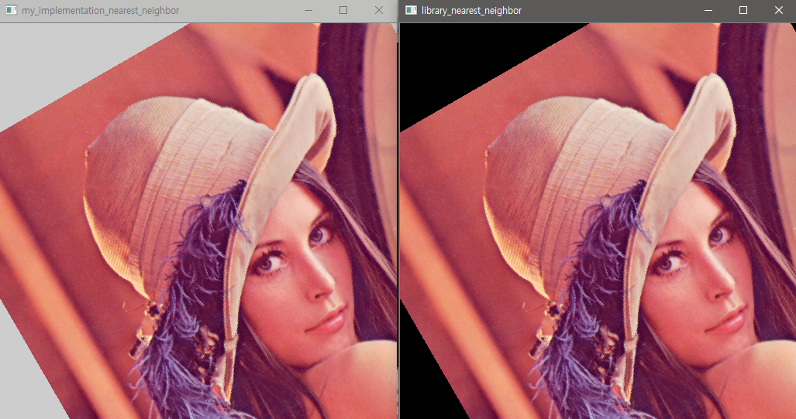

직접 구현 (좌), 라이브러리 구현(우)

> - 30도 회전 후 x,y를 1.2배 확대하고 x축으로 20 이동한 복합변환이 사용됨
> - 직접구현의 경우 영상의 초기값을 따로 지정하지 않아 배경 값이 127로 사용됨

##### (2-2) Bilinear interpolation

Bilinear interpolation 기법은 연산 결과로 나온 소스의 좌표를 한 곳만 사용하지 않고 주변 좌표를 모두 이용하여 소수점만큼 가중치를 부여하여 사용하는 방법이다. 가까운 좌표일 수록 가중치가 크게 부여하며 y방향과 x방향 두 방향의 선형적인 가중치를 동시에 사용하기 때문에 bilinear 라고 불린다.

```cpp
...
	wY = pos[0] - round(pos[0])
	wX = pos[1] - round(pos[1])
	pos[0] = round(pos[0])
	pos[1] = round(pos[1])
    
	dest(y,x) = (1-wX)*((1-wY)*source(pos[0], pos[1]) + wY*source(pos[0]+1, pos[1])) +
        		(wX) * ((1-wY)*source(pos[0], pos[1]+1) + wY*source(pos[0]+1, pos[1]+1))
...
```

###### 구현 결과

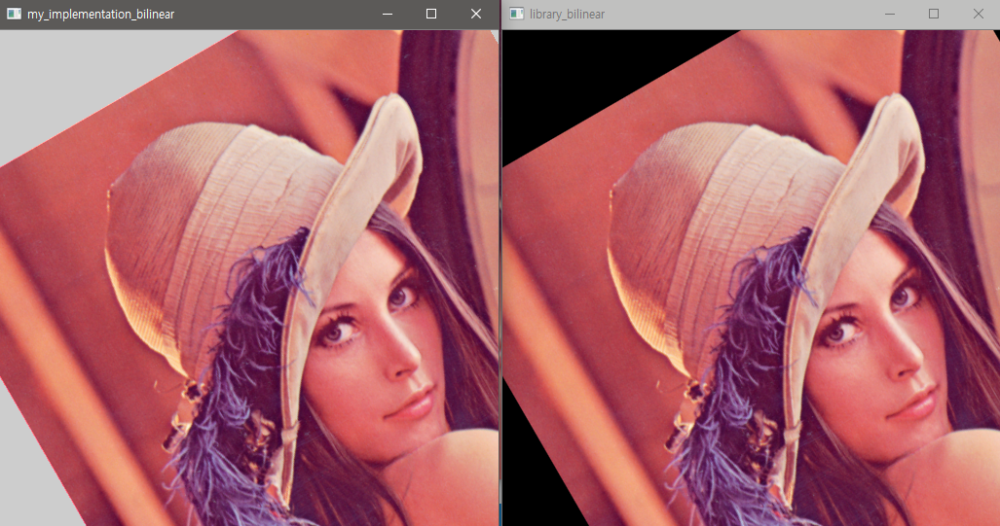

###### NN vs Bilinear

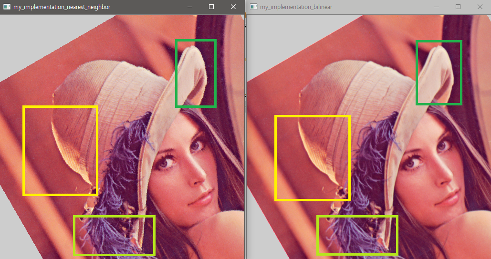

NN(좌), Bilinear(우)

> nearest neighbor interpolation 과 비교하면 bilinear가 보다 매끄러움을 확인할 수 있다.

##### (2-3) 추가적인 Transformation

| ,transition(20,30),rot(-20).png)  | ,scale(0.8,1.0),rot(-150).png) |
| :---------------------------------------------------------: | :----------------------------------------------------------: |
|       scale(0.5,2.0) >> transition(20,30) >> rot(-20)       |      transition(-50,-20) >> scale(0.8,1.0) >> rot(-150)      |
| ,transition(-50,70),scale(1.3,1.1).png) |  ,rot(460),transition(100,0).png)  |
|      rot(270) >> transition(-50,70) >> scale(1.3,1.1)       |       scale(0.7,0.5) >> rot(460) >> transition(100,0)        |

## 2. Corner detection

두 개의 서로 다른 영상에서 같은 오브젝트(2D)를 검출하기 위한 방법 중 하나는 그 오브젝트의 특징을 검출하는 것이다. 영상의 이동, 회전, 크기에 불변한 오브젝트의 특징을 검출할 수 있다면 이 특징을 이용하여 무수히 많은 서로 다른 영상에서도 해당 오브젝트를 검출할 수 있을 것이다. 이러한 사실은 특징이 될 수 있는 점이 중요한 정보를 포함할 가능성이 상당히 높음을 의미한다.

이전에 배운 영상의 경계(Edge)는 이동에 불변하고 회전에 상당히 불변한 좋은 특징이지만 정보가 매우 방대하여 계산량도 많고 다루기 힘들다. 때문에 에지보다 더 데이터를 적게 가지면서 이동과 회전에 불변한 방법이 필요한데 에지보다 한 차원 더 나아간 코너를 검출하는 방법이 있다. 지금부터는 코너를 검출하는 여러 알고리즘에 대해 설명하겠다.

### 2-1. 모라벡 코너 검출

모라벡 코너는 영상의 `평평한 부분(Flat)에는 낮은 값`, `에지에는 중간 값`, `코너에는 높은 값`을 부여하는 함수를 다음과 같은 수식으로 나타낸다.
$$
S(v,u) = \sum_y\sum_xw(y,x)(f(y+v,x+u)-f(y,x))^2
$$
이 때 $f(y,x)$는 입력영상, $w(y,x)$ 는 마스크이다.

> 마스크는 주로 값이 1이고 크기가 $3$x$3$인 박스형 마스크를 사용한다.

쉽게 말하자면 `현재 픽셀정보`에서 $v, u$ 만큼 움직인 `주변 픽셀정보`를 빼고 제곱하여 모든 픽셀에 대해 누적 합(SSD : sum of squared difference)하여 얻어지는 값 $S(v,u)$에 대하여 각 $v, u$로 반복해서 얻어지는 맵 
$$
S = \{\\ 
S(-1,-1)\ \ \ \ \ S(-1,0)\ \ \ \ \ S(-1,1)\\
S(0,-1)\ \ \ \ \ \ \ \  S(0,0)\ \ \ \ \ \ \ \ S(0, 1)\\
S(1,-1)\ \ \ \ \ \ \ \  S(1,0)\ \ \ \ \ \ \ \ S(1,1)  \\\}
$$
$S$가 현재 픽셀정보에서 얻어지는 코너가능성 정보(높을수록 코너일 확률이 높은 정보)가 된다.

이 S맵의 각 값들은 다음과 같은 특성을 갖는다.

- flat한 영상에서 9개의 값들이 대체로 낮은 값을 지닌다.
- 한 뱡향으로 edge가 형성되는 영상에서는 그 방향에서 대체로 낮은 값, 나머지 S들은 높은 값을 갖는다.
- corner에서는 대체로 높은 값을 갖는다.

이러한 $S$맵의 특성을 이용하여 모라벡은 `(동, 서, 남, 북) 정보`가 모두 threshold 보다 높을 때 코너로 평가하였다.
$$
C\ =\ 코너\ 가능성\ 정보\ =\ min(\ S(동),\ S(서),\ S(남),\ S(북)\ )
\\
C = min(\ S(0,1),\  S(0,-1),\ S(1,0), \ S(-1,0)\ )
\\
이때,\ threshold <= C\  이면\  코너로\ 판단
$$
이때 C 값의 범위는 0부터 585255이다.

- 0을 갖는 경우 : 모든 영상의 픽셀정보가 같을 때
- 585255를 갖는 경우 : 모든 영상이 255, 0이 반복되면서 열의 개수가 홀수인 영상 (255$^2$ * 9)

방향 정보를 동, 서, 남, 북만 판단하기 때문에 회전에 완전히 불변하다고 말할 수 없다. 90회전, 180회전 등의 회전에만 불변하다. 또한 놓치는 코너가 있을 수 있다.

#### 구현 결과

아래는 모라벡 코너 알고리즘을 이용하여 코너를 검출한 영상이다.

0또는 255의 값을 가지는 이진 명암 영상으로 출력하였다.

##### (1) Threshold = 1000

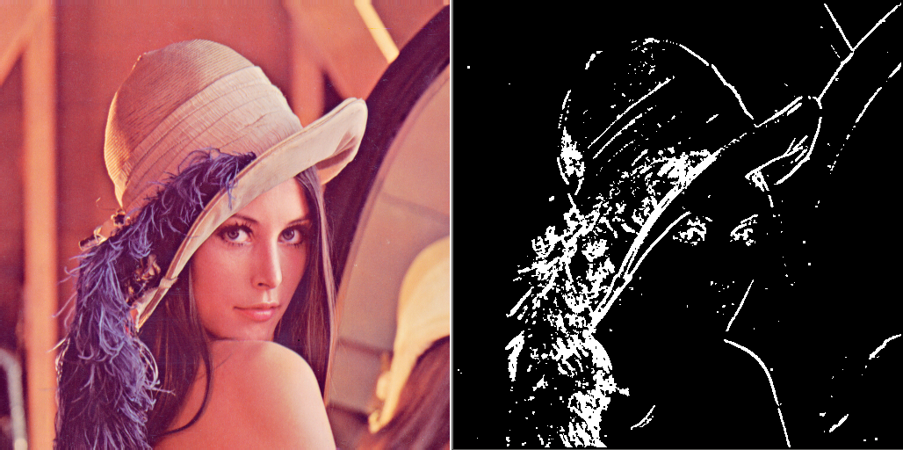

##### (2) Threshold = 3000

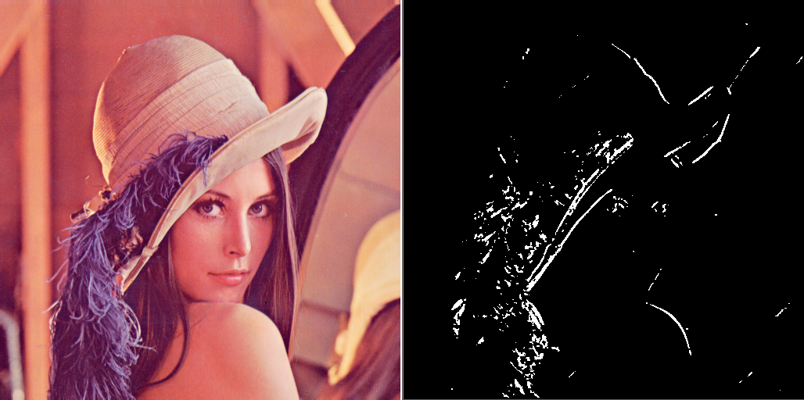

### 2-2. 해리스 코너 검출

해리스 코너는 모라벡 코너가 가지는 문제점을 다음과 같이 극복하였다.

1. 잡음에 대처하는 가중치 제곱차의 합(WSSD : weighted sum of squared difference) 사용

  
   $$
   S(v,u) = \sum_y\sum_xG(y,x)(f(y+v,x+u)-f(y,x))^2
   $$

   > $G(y,x)$는 가우시안 마스크, $f(y,x)$는 입력 영상

1. 동서남북, 8방향 정보를 뛰어 넘어 회전에 강인한 미분을 이용한 그라디언트 검출 사용

   테일러 확장을 이용하여 다음과 같은 식을 얻는다.


$$
   f(y+v, x+u) \approx f(y,x) + v\dfrac{\part f}{\part y} + u\dfrac{\part f}{\part x}
$$

   > 편미분은 소벨 또는 프레윗 마스크를 사용한다.
   >
   > 또한 위 식은 1.의 WSSD 식에 대입할 수 있다. 대입하면 아래와 같다.

$$
S(v,u) \approx \sum_y\sum_xG(y,x)(f(y,x) + v\dfrac{\part f}{\part y} + u\dfrac{\part f}{\part x} - f(y,x))^2
   \\
   = \sum_y\sum_xG(y,x)(v\dfrac{\part f}{\part y} + u\dfrac{\part f}{\part x})^2
   \\
   = \sum_y\sum_xG(y,x)(v^2\dfrac{\part f}{\part y}^2 + 2vu\dfrac{\part f}{\part y}\dfrac{\part f}{\part x} + u^2\dfrac{\part f}{\part x})
   \\
   = \sum_y\sum_xG(y,x) \begin{bmatrix}v & u\end{bmatrix} \begin{bmatrix}\dfrac{\part f}{\part y}^2 & \dfrac{\part f}{\part x}\dfrac{\part f}{\part y}\\\dfrac{\part f}{\part x}\dfrac{\part f}{\part y} & \dfrac{\part f}{\part x}^2\end{bmatrix} \begin{bmatrix}v\\u\end{bmatrix}
   \\
   = \begin{bmatrix}v & u\end{bmatrix}\sum_y\sum_xG(y,x)\begin{bmatrix}\dfrac{\part f}{\part y}^2 & \dfrac{\part f}{\part x}\dfrac{\part f}{\part y}\\\dfrac{\part f}{\part x}\dfrac{\part f}{\part y} & \dfrac{\part f}{\part x}^2\end{bmatrix}\begin{bmatrix}v\\u\end{bmatrix}
   \\
   = \begin{bmatrix}v & u\end{bmatrix}\sum_y\sum_x \begin{bmatrix}G * \dfrac{\part f}{\part y}^2 & G*\dfrac{\part f}{\part x}\dfrac{\part f}{\part y}\\\ G * \dfrac{\part f}{\part x} \dfrac{\part f}{\part y} & G*\dfrac{\part f}{\part x}^2\end{bmatrix}\begin{bmatrix}v\\u\end{bmatrix}
$$

   이렇게 얻게 되는 S맵은 -1, 0, 1 등의 정수가 아닌 실수의 정보로도 얻을 수 있기 때문에 어떠한 회전에도 강인하게 코너를 반응시킬 수 있다.

   이때 미분의 곱으로 이루어진 $2$x$2$ 행렬을 `자가 공관계 행렬` 또는 `2차 모멘트 행렬`이라고 부르는데 이 행렬의 특징은 두 고유값이 고르게 작으면 flat, 하나만 크면 한 방향으로 edge, 두 개 모두 크면 여러 방향으로 변화가 있는 점임을 알 수 있다는 것이다.

   2차 모멘트 행렬은 영상의 가우시안, y방향 미분, x방향 미분 만으로 쉽게 구할 수 있으며 고유값의 합은 다음과 같은 식으로 근사, 고속시킬 수 있다.
$$
   C = \lambda_1\lambda_2 - k(\lambda_1+\lambda_2)^2
   \\
   = det(A) - k\times trace(A)^2
   \\
   = (pq-r^2) - k(p+q)^2
   \\
   (A = \begin{bmatrix}p & r \\ r & q\end{bmatrix} 일 \ 때)
$$


#### 구현 결과

위 해리스 알고리즘을 이용하여 코너를 검출한 결과는 다음과 같다.

- C가 특정 threshold보다 클 때 255로 설정하는 이진 명암 영상으로 구현하였다.
- 직접 구현은 $3$x$3$ sobel 마스크와 $3$x$3$ 가우시안 마스크($\sigma$ = 0.35) 를 이용하였다.

##### (1) k = 0.04, threshold = 0.00001

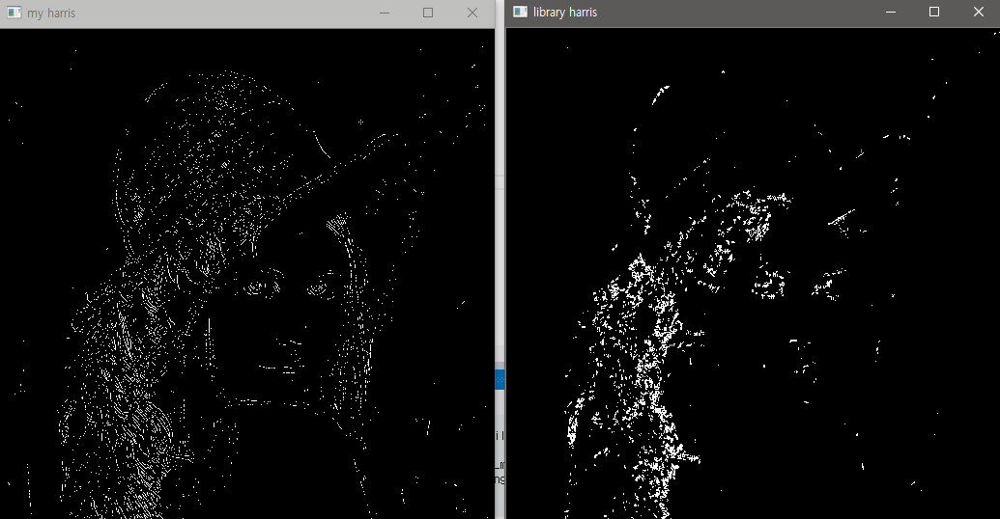

직접구현(좌), 라이브러리 사용(우)

##### (2) k = 0.04, threshold = 0.0001

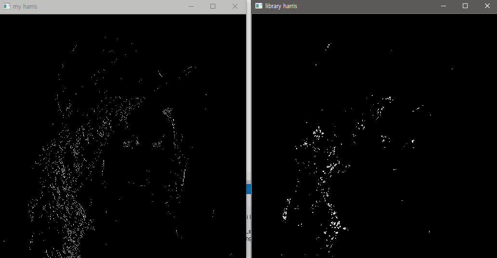

직접구현(좌), 라이브러리 사용(우)

### 2-3. 슈산 코너 검출

슈산은 모라벡, 해리스와는 전혀 다른 접근 방법으로 코너를 검출한다.

어떤 특정 점이 원형의 주변 픽셀과 얼마나 흡사한가를 나타내는 정보(USAN : [우산])를 이용하여 많이 흡사하다면 flat, 반 정도 흡사하다면 edge, 흡사하지 않다면 corner라고 판별하는 휴리스틱한 알고리즘이다.

USAN은 특정 픽셀을 기준으로 주변 픽셀과의 차가 threshold1 보다 작은 화소를 카운트한다.

예를 들어 $7$x$7$ 원형 마스크의 커버리지가 37 이고 threshold1 보다 작은 화소의 개수가 20 이라면 USAN은 $\dfrac{20}{37} \approx 0.54\%$ 가 된다. 이때 USAN이 threshold2 보다 낮다면 코너로 판별한다.

> 두 가지 threshold가 존재하는데 각각 상반되는 정보를 갖는다.
>
> 1. threshold1
>
>    두 픽셀 차를 어디까지 흡사하다고 허용해줄지 정하는 정보.
>
>    주변과 다를수록 코너이므로 이 값은 클수록 코너를 적게 검출한다.
>
> 2. threshold2
>
>    구해진 USAN의 영역이 threshold2를 기준으로 코너인지 아닌지 판별된다.
>
>    USAN은 낮을 수록 코너일 확률이 크다.
>
>    때문에 threshold2는 커질수록 코너를 많이 검출한다.

SUSAN 논문을 집필한 스미스는 $7$x$7$ 크기의 원형마스크(너비 37)에서 USAN이 50%보다 작을 때 코너, 75%보다 작을 때 에지를 검출할 수 있다고 제시했다.

이진화되지 않은 영상은 다음과 같은 수식으로 구해진다.
$$
C = q - USAN
\\
(USAN > t_2\ 라면\ C=0)
\\
q = 0.75 \times maskArea (7\times7\ 행렬에서\ maskArea는\ 37)
$$
일반적으로 $q$는 $t_2$보다 같거나 크므로($t_2$는 0.75보다 작은 것이 일반적) C는 음수가 되지 않는다.

#### 구현 결과

##### (1) SUSAN ( $t_1$ = 30, $t_2$ = 0.5 ) 

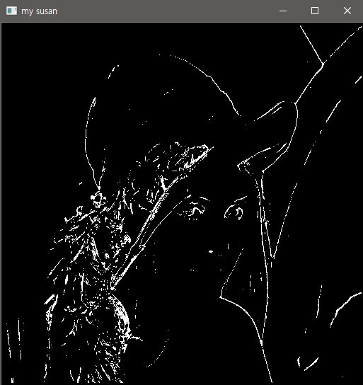

##### (2) SUSAN ( $t_1$ = 50, $t_2$ = 0.5 )

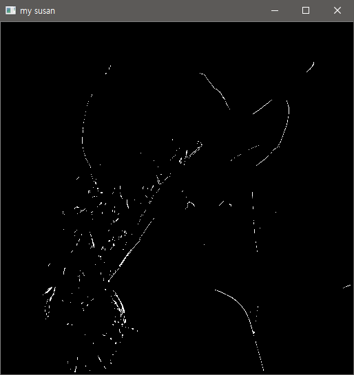

### 2-4. 각 코너 검출 결과에 대한 비교와 분석

lena 영상은 정확한 육안 분석에 어려움이 있어 다른 이미지를 가지고 분석을 해보고자 한다.

#### (1) Chessboard

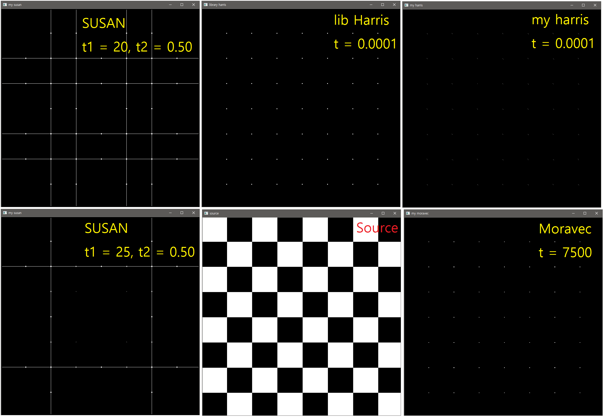

> 확대해서 봐주세요.

직접 구현한 해리스 코너(my harris)의 경우 비최대억제 알고리즘을 사용하지 않아 비슷한 부분에 점이 2개나 검출되는 것을 볼 수 있다.

가장 모범적인 사례는 라이브러리 해리스 코너인데 이와 가장 근사한 것이 모라벡 코너였다. 아무래도 동서남북을 기준으로 검출하다보니 이런 동서남북의 에지가 강인하게 나타나는 영상에서 검출이 잘 되는 것으로 보인다.

슈산의 경우 제대로 검출이 되지 않아 threshold를 조정하면서 결과를 여러 번 보았는데도 불구하고 코너가 아닌 에지를 검출해버리는 상황이 발생하였다.

#### (2) Qr Code

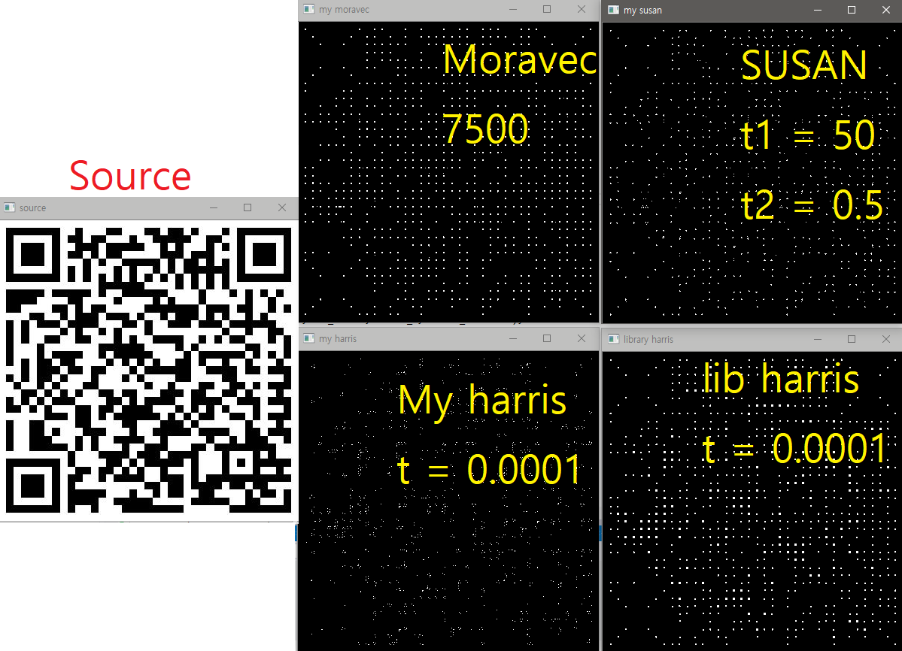

가장 모범적인 모형인 라이브러리 해리스코너를 기준으로 모라벡이 역시 동서남북으로 뚜렷한 영상에 대해 검출이 잘 되는 것을 볼 수 있었다. SUSAN 역시 상당히 코너를 잘 검출했다.

#### (3) Leaf

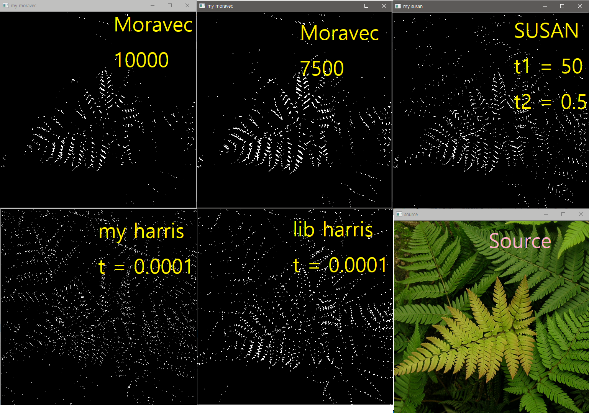

동서남북으로 뚜렷하지 않은 영상을 참고하기 위해 잎사귀 사진을 사용하였다.

육안으로 보기에는 SUSAN이 Moravec 보다 더 검출이 잘 된 것으로 보인다. 단연 harris corner가 제일 잘 검출하였다.

####(4) 결론

모라벡의 경우 동서남북으로 뚜렷하지 않은 경우 에지를 검출하려는 특성이 살짝 나타났고 코너의 굵기도 항상 컸다. 하지만 동서남북으로 뚜렷한 이미지에 대해 상당히 좋은 결과를 보였다.

해리스 코너의 경우 직접 구현한 구현체가 비최대억제 및 라이브러리에서 사용되는 추가적인 기술들을 똑같이 따라하지 못해 아름다운 코너를 검출하지는 못했으나 코너의 굵기와 검출정도로 보았을 때 상당히 강인하다고 볼 수 있었다

슈산의 경우 복잡한 영상에 대한 코너를 모라벡보다 효과적으로 검출하는 것 처럼 보인다. 허나 간단하고 명확한 에지를 가진 영상에 대해 코너만 검출하는데 어려움을 보인다.

---

> 인용
>
> - 컴퓨터 비전 - 오일석
> - docs.opencv.org
> - wikipedia.org